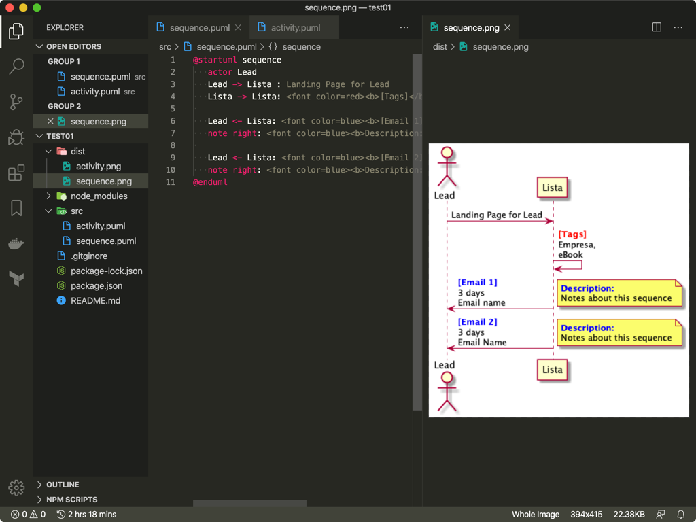
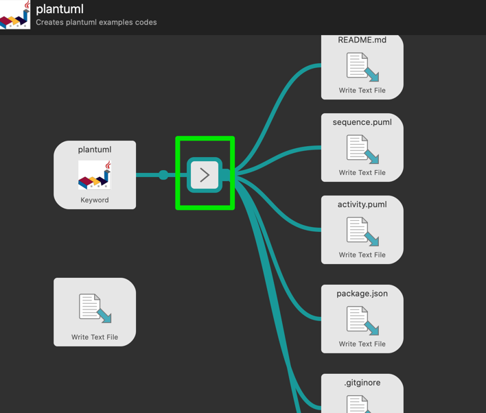
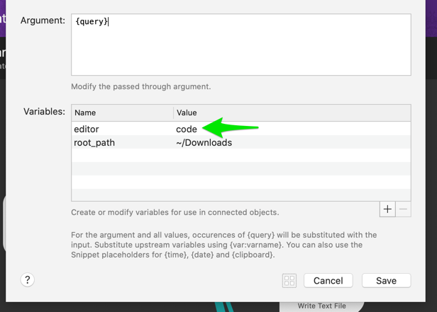

# Plantuml project workflow

This workflow creates a [PlantUML](https://plantuml.com) project to simplify diagram development.




## Requirements

* Visual Studio Code (Select as default Editor)
* npm
* onchange

## How to use it

Run build to build diagram

```bash
npm run build
```

or run watch to update diagram on save

```bash
npm run watch
```

## Change Editor

`Visual Studio Code` is used in workflow but you can select editor that you want as `sublime`.


